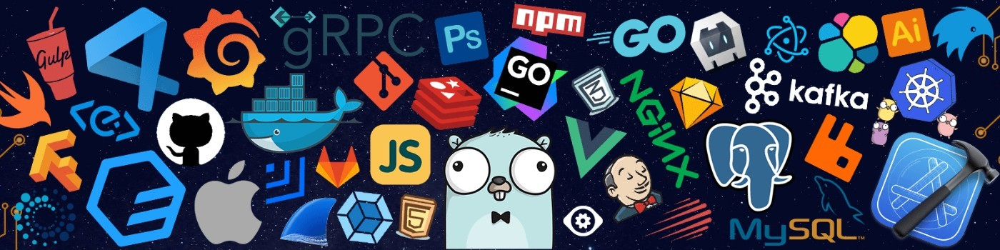

<!-- Banner -->

  

<h1 align="center">Hi, this is Shwetha 👋</h1>

  <b>Software Engineer @ Verifone</b> 
  Building things, breaking things, and learning along the way.

  
  

 

## 🧰 Tech Stack

  

<table align="center">
  <tr>
    <td align="center" width="150"><b>Languages</b></td>
    <td>C#, Java, SQL</td>
  </tr>
  <tr>
    <td align="center"><b>Frameworks</b></td>
    <td>.NET, Spring Boot</td>
  </tr>
  <tr>
    <td align="center"><b>Databases</b></td>
    <td>SQL Server, MongoDB</td>
  </tr>
</table>

 

## 📊 GitHub Stats

  

 

## ✍️ Latest Blogs
<!-- BLOG-POST-LIST:START -->
- [What Happens When You Type a URL in Your Browser? A Beginner-Friendly Explanation](https://medium.com/@shwethabaliga/what-happens-when-you-type-a-url-in-your-browser-a-beginner-friendly-explanation-44c7dd7fc855?source=rss-4667262f403d------2)
- [Git & GitHub Made Simple: Everything I Learned from Kunal Kushwaha's Tutorial](https://medium.com/@shwethabaliga/git-github-made-simple-everything-i-learned-from-kunal-kushwahas-tutorial-670a6b802a35?source=rss-4667262f403d------2)
<!-- BLOG-POST-LIST:END -->

 

## 🤝 Recent Activity
<!--START_SECTION:activity-->
1. 💪 Opened PR [#411](undefined) in [acesdit/ProjectHive](https://github.com/acesdit/ProjectHive)
2. 💪 Opened PR [#410](undefined) in [acesdit/ProjectHive](https://github.com/acesdit/ProjectHive)
3. 🗣 Commented on [#42](https://github.com/amaanalikhan3000/Cinemahub2/pull/42#issuecomment-3473607545) in [amaanalikhan3000/Cinemahub2](https://github.com/amaanalikhan3000/Cinemahub2)
4. 🗣 Commented on [#42](https://github.com/amaanalikhan3000/Cinemahub2/pull/42#issuecomment-3473606220) in [amaanalikhan3000/Cinemahub2](https://github.com/amaanalikhan3000/Cinemahub2)
5. 💪 Opened PR [#42](undefined) in [amaanalikhan3000/Cinemahub2](https://github.com/amaanalikhan3000/Cinemahub2)
<!--END_SECTION:activity-->

 

  

  

